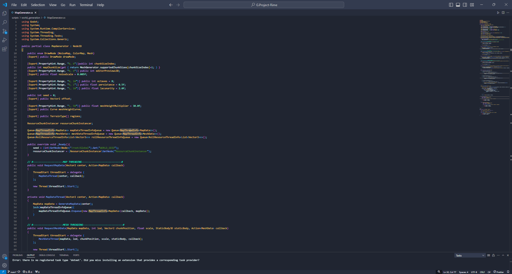

# Project Rime
## By Seth Gran
## Godot 4.2.1 Stable Mono

# Download and try the most recent build on Itch.io:
https://i-am-set.itch.io/project-rime

### Features:
- Completely fleshed out command console.
- Procedurally endless world generation.
- Dynamic daya/night cycle.
- Dynamic temperature system.

### Planned Features:
- Functional inventory and crafting system.
- AI pathfinding and behavior.
- Interactable world items.

### Some Screenshots:

### Credits Thus Far:
Gioele Fazzeri - "Cold Snowfall Ambience"
